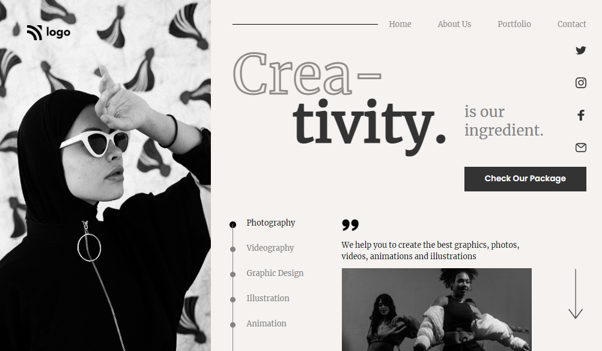

## 🔗Project 14 Link
https://html5-css3-project-14.netlify.app/

# ✨ Project 14 : Dance Home Page ✨
This assignment is written in **HTML5 and CSS3** which is given in **"JavaScript Full Stack Web Developer Bootcamp"** by **iNeuron**.

 

 

 

## 📌 Screenshot
 

 

## 📌 What I Learn

    👉 Structuring HTML and CSS.
    👉 Various CSS Selectors etc.
    👉 Flexbox in CSS.
    👉 CSS Positions.
    👉 -webkit text stroke CSS property.
    👉 How to use SVG images.

## I took 3 hours to complete this project and I really enjoyed it 😊.

## 💬 Connect With Me

- **LinkedIn** - https://www.linkedin.com/in/vishal-kumar-909758228/
- **Instagram** - https://www.instagram.com/_vishal.kumar07/

## 📌 Acknowledgments

- Course Instructor - [Hitesh Choudhary](https://github.com/hiteshchoudhary)